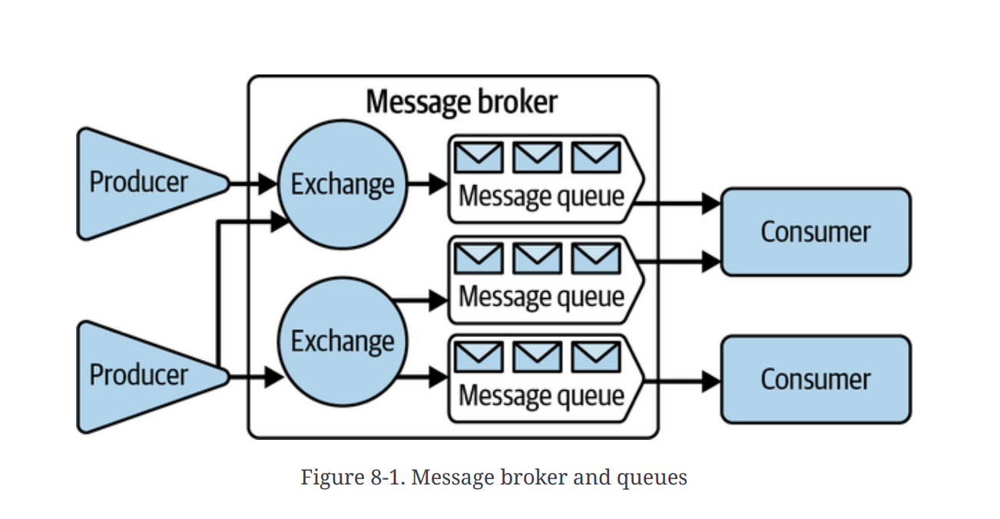
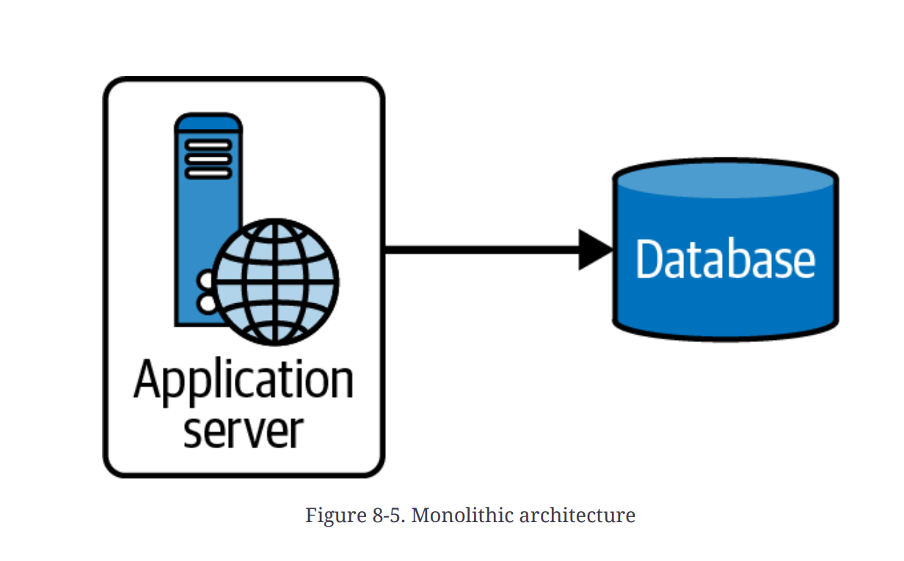
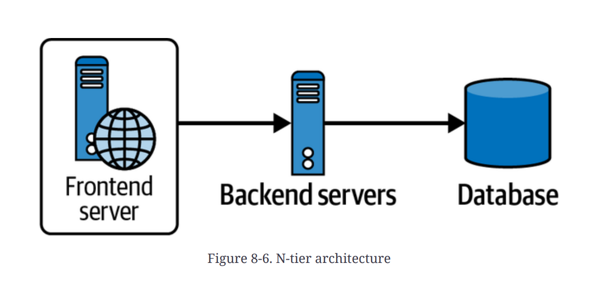
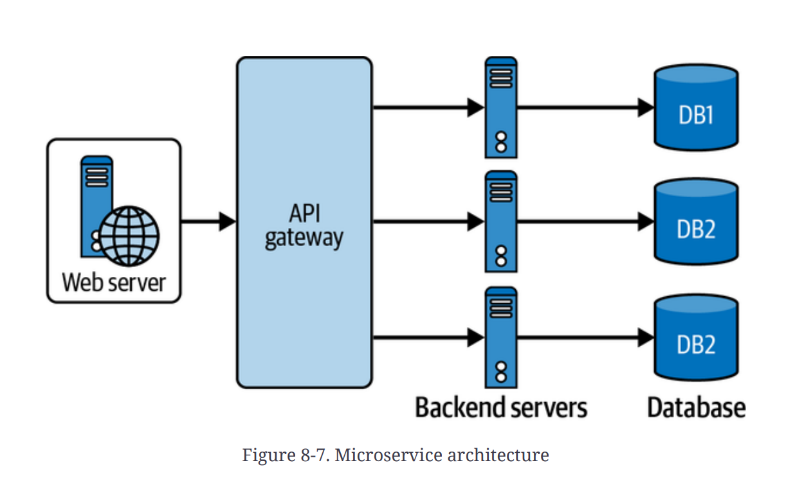
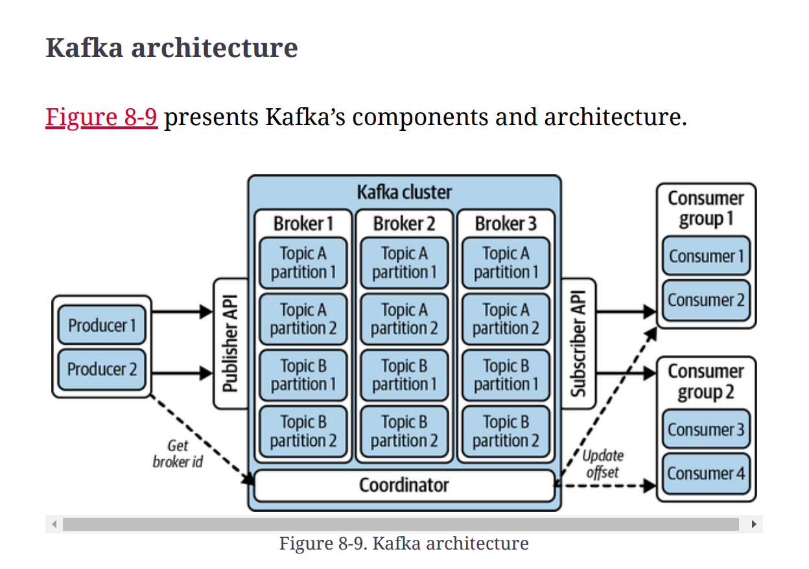

# Chapter 8. Architectural Designs and Patterns

Chapter 8 explores different **architectural designs and patterns** that form the backbone of modern software systems, supporting scalability, maintainability, and efficient data handling in diverse applications. The chapter begins with **Change Data Capture (CDC)** and then moves to asynchronous communication using the **publisher-subscriber pattern**,. Core concepts like **choreography** (decentralized) and **orchestration** (centralized) are detailed for managing service interactions,. The discussion also includes comparisons of **microservices** with **monolithic designs** and covers the **saga pattern**, **event-sourcing pattern**, **serverless architecture**, **big data architectures**, and **domain-driven design**,. Essential cloud architecture patterns, ranging from resilience techniques (like the **circuit breaker**) to transactional strategies (like **saga orchestration**), are also covered.

---

## Change Data Capture (CDC)

**Change Data Capture (CDC)** is a sophisticated technique used for data integration that tracks and captures changes in data at the source database in real time,. This method provides fresh data across the organization by pushing changes to various destinations, such as data warehouses, processing engines, or other databases, ensuring all systems reflect the latest information. CDC is driven by the need for real-time data processing, as traditional batch-processing methods are often too slow, may require scheduled downtime, and can negatively affect system performance during data extraction.

### Benefits of CDC

CDC offers several advantages over traditional batch loading, particularly in real-time performance:

- **Reduced latency:** CDC allows for nearly instantaneous data updates, which is vital for quick reactions to changes, such as stock updates or dynamic pricing.
- **Lower costs and bandwidth usage:** It minimizes bandwidth needs and data transfer costs by transmitting only the changes made since the last transfer.
- **Increased system efficiency:** By capturing changes as they occur, CDC minimizes the impact on the source systems, avoiding the intensive resource use associated with batch processes.

### CDC Implementation Techniques

Software architects can implement CDC using various techniques, suitable for different system architectures and performance needs:

1.  **Audit-column-based CDC:** This is a simple method that uses timestamp columns (e.g., `created_at` or `updated_at`) to track when records were inserted or last modified. Its main advantages are simplicity and low overhead, as it leverages the inherent capabilities of relational database management systems (RDBMSs).
2.  **Log-based CDC:** This technique reads the database's transaction logs, which reliably record all changes for data recovery and integrity, avoiding additional overhead on the database itself. This method supports near real-time data integration, making it appropriate for high-availability systems. **Stream-based CDC** is an extension of this method that formats log data into more consumable streams, such as Amazon DynamoDB streams.
3.  **Table deltas:** This approach determines changes by periodically taking full snapshots of a table and comparing them. This method is typically more resource intensive and introduces delays, making it generally suited for batch-processing scenarios or systems with lower transaction volumes.
4.  **Trigger-based CDC:** This method uses database triggers to automatically execute predefined procedures or SQL commands in response to events like `INSERT`, `UPDATE`, or `DELETE`. Although this approach allows for real-time capture and customization, managing triggers can increase the load and complexity, especially in large-scale systems.

CDC should be noted in comparison to **event sourcing**: Event sourcing uses events as the source of truth to re-create or revert a system's state over time, while CDC focuses on capturing database changes primarily for replication or data integration.

---

## Publisher-Subscriber (Pub/Sub) Architecture

The **Publisher-Subscriber (Pub/Sub) architecture** is a foundational model in event-driven programming that promotes **loose coupling** between system components and facilitates **asynchronous communication**.

### Pub/Sub vs. Observer Pattern

The primary distinction between the Pub/Sub model and the observer pattern is the routing mechanism.

- In the **observer pattern**, observers directly register with the subject and are aware of it; communication is generally synchronous.
- In the **Pub/Sub model**, publishers are abstracted from subscribers through a **broker or event bus**, enabling asynchronous communication and seamlessly supporting complex many-to-many interactions.

### Message Brokers and Queues

**Message brokers** are key components in Pub/Sub architectures responsible for managing the transmission, routing, maintenance, and reliable delivery of messages between producers (publishers) and consumers (subscribers).

- A typical broker architecture employs **topics** (to categorize messages) and **queues** (to temporarily store messages).
- **Advanced Message Queuing Protocol (AMQP)** is an open standard designed for high reliability and interoperability in message passing.

**Message queues** are fundamental infrastructure components that serve as a temporary holding pen for messages awaiting routing from publishers to subscribers. **Apache Kafka** is a prominent example of a message queue system designed to support **high-throughput** applications and handle large volumes of data efficiently,.

---

## Choreography and Orchestration

These two approaches define how service interactions are managed in distributed systems, especially in microservices.

### Choreography (Decentralized)

**Choreography** uses a decentralized approach where **no central coordinator** exists.

- Each service determines its actions based on the **events** it consumes.
- This approach promotes **loose coupling**, enhanced scalability, and resilience since services operate independently.
- A key subpattern is **choreographed asynchronous events**, where services communicate via a central message bus.
- **Challenges:** Monitoring the overall flow and enforcing specific business rules can be difficult due to the decentralized architecture, making debugging complex as log entries are scattered across various services.

### Orchestration (Centralized)

**Orchestration** employs a **central coordinator**, or **orchestrator**, that manages the process flow and explicitly directs services on when to act.

- This model simplifies **monitoring** and managing complex business logic, error handling, and recovery, as the orchestrator tracks process states.
- **Challenges:** It can increase coupling between services and risks becoming a **single point of failure**, potentially affecting system resilience and scalability.

#### Orchestration Patterns

Orchestration can be implemented in various patterns:

1.  **Orchestrated, synchronous, and sequential pattern:** The orchestrator sends synchronous requests sequentially, waiting for each response before moving to the next step. This is ideal for complex workflows requiring tasks to be completed in a specific order.
2.  **Orchestrated, synchronous, and parallel pattern:** Executes independent tasks simultaneously to improve performance and reduce latency, effective in scenarios like data-aggregation services.
3.  **Orchestrated, asynchronous, and sequential pattern:** The orchestrator sends asynchronous requests, allowing services to process tasks independently and return results via callbacks or message queues. This is suitable for systems involving long-running tasks, such as batch processing.
4.  **Hybrid orchestration and choreography pattern:** Combines centralized orchestration for explicit, controlled workflows with choreography for implicit, event-driven operations. This offers flexibility in complex systems where certain parts of the workflow require strict control while others benefit from decentralized execution.

### Deciding Between Choreography and Orchestration

The choice depends on specific project requirements:

- **Choreography** is preferred when **high scalability and resilience** are required, and the business process can be handled with a decentralized approach.
- **Orchestration** is better suited for **complex processes** requiring tight control and coordination, especially when intricate business logic must be strictly managed.

---

## Big Data Architecture

Big data architectures are designed to handle the **5 Vs of data** (**volume, velocity, variety, veracity, and value**), allowing organizations to derive actionable insights and maintain performance scalability.

1.  **Lambda Architecture:** This is a hybrid model that combines batch and real-time processing.
    - **Batch layer:** Processes large volumes of historical data for comprehensive and accurate views (high latency).
    - **Speed layer:** Processes data in real time as it arrives, providing low-latency (but potentially approximate) views to compensate for the batch layer's latency.
    - **Serving layer:** Merges the output from both the batch and speed layers into a coherent view for end users.
    - The maintenance of two separate codebases and systems for batch and speed processing introduces operational complexity.
2.  **Kappa Architecture:** This model simplifies the Lambda architecture by treating **all incoming data as a stream**. It uses a single processing layer (**stream-processing layer**) for both historical and real-time data, thus removing the overhead of maintaining two separate systems. It is ideal where fast data recency is critical.
3.  **Data Lake Architecture:** Data lakes are centralized repositories designed to **store, process, and secure large volumes of raw structured and unstructured data**.
    - They store data in its native format, supporting low-cost hardware scaling, flexible configuration, and analysis of diverse data types (e.g., logs, JSON, binary).
    - Data lake architecture integrates with various big data processing frameworks to enable comprehensive analytics and machine learning directly on the stored data.

---

## Solution Architecture

Solution architecture defines how systems are structured to meet business requirements, evolving from tightly coupled designs to highly decoupled, specialized services.

1.  **Monoliths:** In this architecture, all application components are **tightly integrated** and run as a **single service**.
    - **Advantages:** They are straightforward to develop, test, deploy, and scale horizontally in early stages. Network interactions between components are skipped, which reduces latency and simplifies handling of unreliable networks.
    - **Challenges:** As applications grow, monoliths become difficult to modify, and scaling specific functions independently becomes challenging.

    

2.  **N-tier Architectures:** Applications are logically divided into layers, typically including Presentation (frontend), Business Logic (middle-tier), and Data Management (backend)—a configuration known as **three-tier architecture**.
    - This **separation of concerns** enhances maintainability, and each layer can be scaled independently according to demand.

    

3.  **Microservices:** This architecture decomposes systems into smaller, **loosely coupled services**, with each service focusing on a single functionality.
    - **Benefits:** Services can be developed, deployed, and scaled independently, enabling faster development cycles, improved fault isolation, and technology diversity.
    - **Challenges:** Increased complexity in operations management, interservice communications, data consistency, and transaction management. Service overhead can increase as each service may require dedicated resources, increasing the resource footprint.

    

---

## Event-Driven Architecture (EDA)

**EDA** is a paradigm that orchestrates system behavior based on the production, detection, and consumption of events. This model allows components to communicate based on state changes across distributed systems without tight coupling, promoting scalability and responsiveness.

### EDA Concepts

- **State machine:** A mathematical abstraction used to design algorithms based on a behavior model where a set of inputs causes a state change.
- **State:** The status of a system awaiting a transition.
- **Transition:** A change from one state to another, triggered by an event or condition fulfillment.
- **Event:** The entity that drives the state changes.

### Paradigms of Event-Driven Implementations

1.  **State-oriented implementation:** Captures only the current state, treating state data as mutable and modified only through defined operations.
2.  **Event Sourcing:** Persists **each state change as an immutable event**. These events serve as the system’s source of truth, allowing the current state to be reconstructed by replaying the events.
    - **Benefits:** Event sourcing supports complete state rebuilds, temporal queries (inspecting state at any point in time), and event replays to correct errors,.
    - **Event Store:** An **append-only persistence** optimized for storing events in sequence, acting as a single source of truth for operations on both application state and data.
    - **Considerations:** This model often involves **eventual consistency** (reads may lag behind recent writes), requires **event log immutability** (corrections require new events), demands proper **event ordering** and linearity, necessitates **consumer idempotency** (to handle duplicate deliveries), and requires **regular snapshotting/materializing** for efficient access to the current state,.

---

## Common Cloud Architecture Patterns

### Event-Based Patterns

- **Command Query Responsibility Segregation (CQRS):** Separates operations that read data (queries) from operations that update data (commands) into different interfaces. This allows for independent optimization and scaling of read models versus write models.
- **Saga:** A pattern for managing **distributed transactions** spanning multiple services,. Each step in the transaction is paired with a corresponding **compensating action** for rollback if the overall transaction fails. Sagas can be implemented via **choreography** or **orchestration**.

### Failure-Tolerant Patterns

- **Circuit Breaker:** Prevents cascading failures by monitoring service stability; if a service fails beyond a threshold, the circuit breaker "trips" and temporarily halts further attempts to invoke the failing service, allowing it time to recover.
- **Retry with Backoff:** Reattempts failed operations with progressively increasing delays (backoff) between retries until a maximum attempt limit is reached. This helps resolve transient faults.
- **Rate Limiter:** Controls the volume of requests a service receives within a specified time frame. This prevents the system from being overwhelmed by traffic spikes, ensuring smooth operation even under heavy load.

### Domain-Based Patterns

- **Domain-Driven Design (DDD):** Focuses software design on the **core domain logic and complexity**, aligning the software’s behavior with the business requirements it fulfills,.
- **Decompose by Subdomains:** Applies DDD principles in a microservice architecture by dividing the system into subdomains, with each **independent microservice** managing a specific business capability.

### API Routing Strategies and Patterns

API routing determines how requests are directed to the appropriate backend services.

- **Strategies:** Includes **hostname routing**, which uses the URL hostname; **path routing**, which uses URL structure; and **HTTP header routing**, which leverages headers (useful for A/B testing or rollouts),.
- **API Gateway:** Serves as a **centralized entry point** for all client requests. It handles functions like request routing, composition, protocol translation, centralized access control, and monitoring. API gateways are commonly used for **external** client-to-service communication.
- **Service Mesh:** An infrastructure layer managing **service-to-service communication** (internal interactions) within a microservice architecture. It provides advanced features like load balancing, security (e.g., mutual TLS), and service discovery, typically implemented using sidecar proxies,.

### Other Cloud Architecture Patterns

- **Anticorruption Layer (ACL):** A protective barrier that translates requests and data between subsystems to preserve the integrity of the core domain model.
- **Strangler Fig Pattern:** Gradually transforms legacy systems by replacing old functionality with new services, eventually "strangling" the old system entirely.
- **Transactional Outbox:** Ensures reliable messaging by writing database changes and adding corresponding records to an "outbox" table within the same transaction. A separate process then sends these messages to a queue, guaranteeing data consistency across service boundaries.
- **Sidecar Pattern:** Deploys a separate container or process alongside a service container to handle platform services (e.g., logging, monitoring, networking), thus decoupling infrastructure concerns from the main application.
- **Backend for Frontend (BFF):** Creates dedicated backend services tailored for specific client types (e.g., mobile vs. desktop), optimizing data transfer for each user interface.
- **Cellular Architecture:** Designs systems as independent, self-contained cells, where failure in one cell does not affect others, supporting high resilience and allowing independent evolution.

---

## Open Source Distributed Systems Architecture

### Hadoop Distributed File System (HDFS)

HDFS is an open source filesystem designed to run on **commodity hardware** for high fault tolerance and **high-throughput access** to large datasets.

- **Key Features:** Data is broken into blocks and replicated across multiple nodes for redundancy. HDFS is optimized for **high throughput** and batch processing, prioritizing speed of data access over low latency. It achieves **fault tolerance** through automatic data replication (typically across three nodes).
- **HDFS Architecture:**
  - **NameNode:** The central component managing the filesystem's **metadata and namespace**. It tracks file locations and coordinates storage across DataNodes.
  - **DataNodes:** The worker nodes that store the actual data blocks. They periodically send heartbeats and block reports to the NameNode.
  - **Secondary NameNode:** Works alongside the NameNode by periodically snapshotting the metadata and applying the edit log, which reduces recovery time in case of NameNode failure.
  - **Blocks:** Data is stored in replicated blocks (typically 128 MB).
  - **Rack Awareness:** HDFS is **rack aware**, ensuring block replicas are distributed across different physical racks in a data center to improve fault tolerance.

### Apache Kafka: Distributed Message Queue

Apache Kafka is an open source distributed **event-streaming platform** designed for high reliability and scalability, capable of handling trillions of events daily in real time.

- **Key Features:** It ensures durability by **persisting messages on disk** and replicating them across multiple brokers. Its design is optimized for **high throughput**, processing millions of records per second. Scalability is achieved through its **partitioning mechanism**, allowing data distribution across multiple nodes.

- **Kafka Architecture:**
  - **Producers:** Push data records into **Topics**.
  - **Consumers:** Read data from Topics, consuming records in the stored order within partitions.
  - **Brokers:** Servers that manage the persistence and replication of data.
  - **Topics:** A category name to which records are published, divided into partitions.
  - **Partitions:** The basic units of scalability and replication in Kafka. They are ordered, immutable sequences of records. Ordering is guaranteed only **within individual partitions**.
  - **Keys:** Used to determine which partition a record is sent to; records with the same key always go to the same partition, preserving order for that key.
  - **Coordinator:** Managed through ZooKeeper (or the newer KRaft protocol) for cluster coordination and metadata management.

#### Kafka Messaging Guarantees

Kafka provides strong guarantees crucial for maintaining data consistency:

- **At-most-once delivery:** Messages may be lost but are guaranteed never to be duplicated.
- **At-least-once delivery:** Every message is delivered at least once, meaning duplicates may occur. Applications consuming messages under this guarantee must implement **idempotency** to prevent unintended side effects from duplicates,.
- **Exactly-once delivery (EOS):** Each message is delivered exactly once, achieved through Kafka’s idempotent producers and transactional APIs,.

| Feature           | HDFS                                     | Kafka,                                 |
| :---------------- | :--------------------------------------- | :------------------------------------- |
| **Core function** | Distributed file storage                 | Message queue/event-streaming platform |
| **Use case**      | Big data storage, large-scale processing | Real-time messaging, event sourcing    |
| **Data model**    | Files                                    | Streams of records                     |

---

## Conclusion

Architectural patterns provide guidelines for building **scalable, maintainable, and efficient systems**. Flexibility, scalability, and fault tolerance ensure that system architecture can evolve with growing business demands and technological advancements. Architects should use these patterns as guidelines rather than rigid rules, focusing on adapting solutions to meet specific business requirements.
