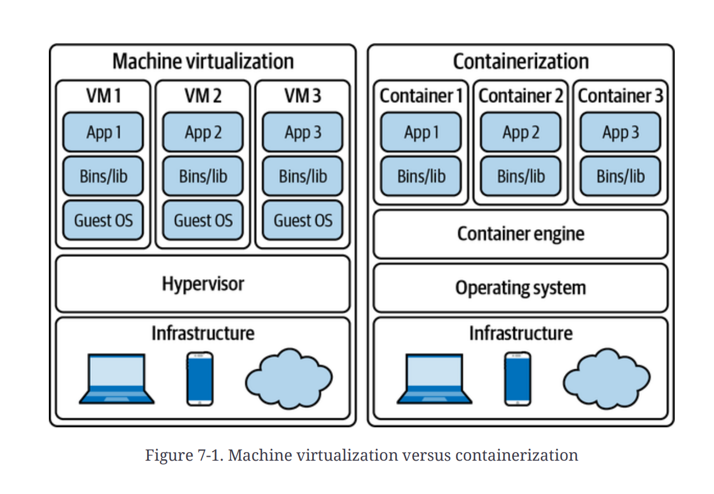
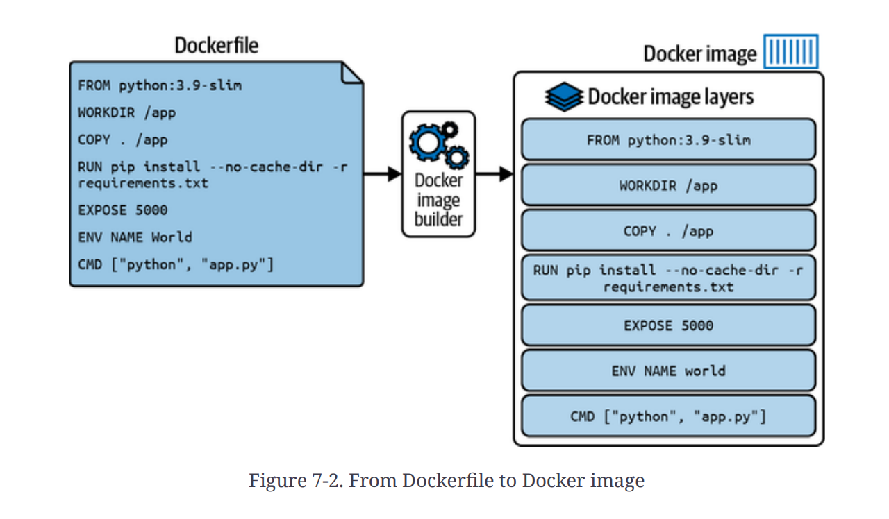
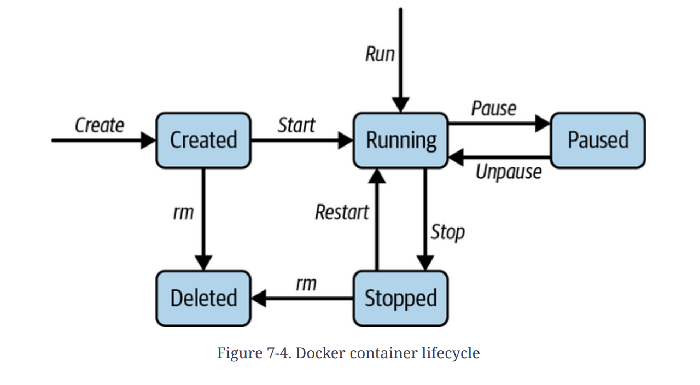
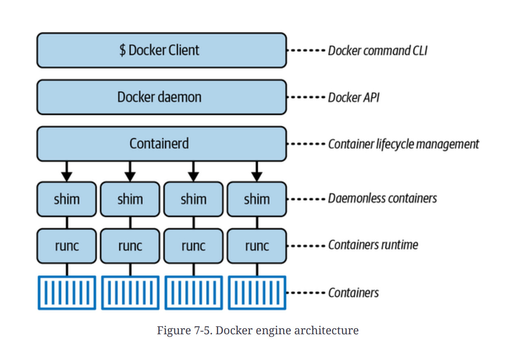
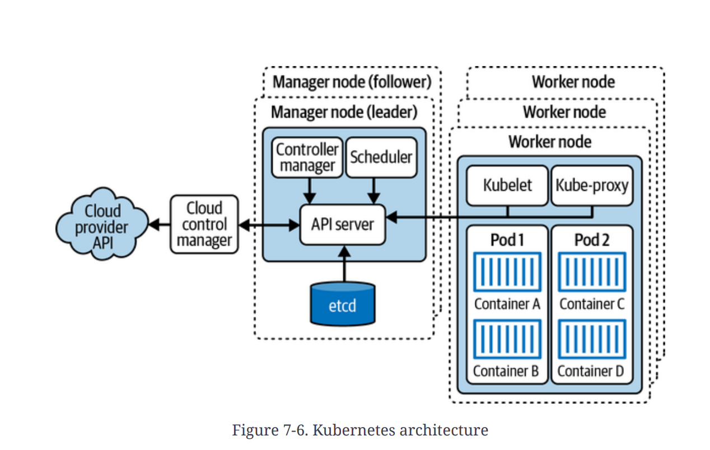
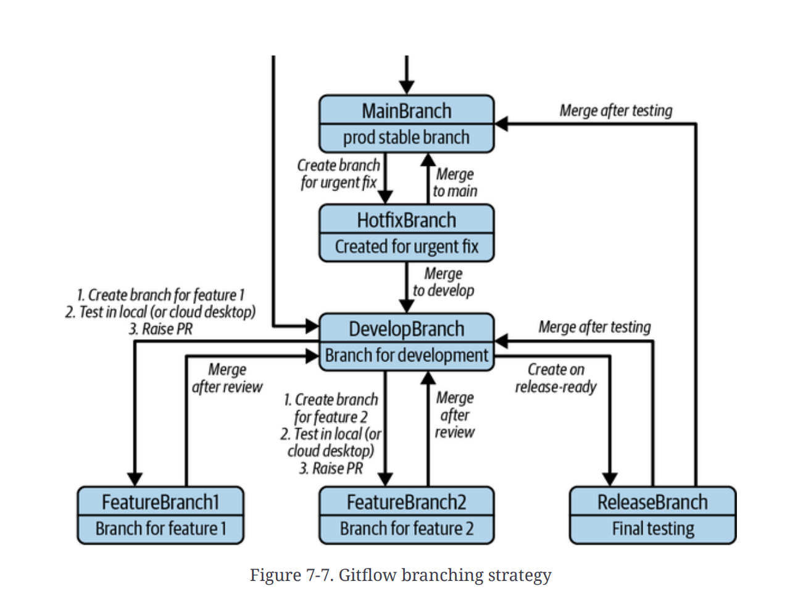

# Chapter 7. Containerization, Orchestration, and Deployments

Chapter 7 focuses on **containerization**, which has revolutionized software development and deployment by offering a solution to the traditional challenges of inconsistency, portability issues, and inefficient resource use inherent in older deployment methods. Containerization involves packaging an application with all its necessary components, such as libraries and dependencies, into a **lightweight, portable unit called a container**. This packaging ensures the application runs consistently across diverse environments, from a developer's laptop to production servers, allowing developers to focus on writing code. **Docker** is highlighted as the most popular tool standardizing this process, streamlining the development lifecycle for efficiency,.

---

## Evolution of Application Deployment

The deployment of applications has evolved significantly:

1.  **Physical Servers:** In the initial stages, applications ran on separate physical servers, often leading to **resource underutilization** and allocation issues, proving to be expensive and inefficient,.
2.  **Virtualization (VMs):** **Virtualization** allowed multiple **Virtual Machines (VMs)** to run on a single physical server's CPU, maximizing resource utilization.
    - A VM is an isolated instance that emulates a physical computer, running its own **OS** and application stack.
    - The **hypervisor** acts as a middle layer between the host machine and VMs, creating virtualized hardware components.
    - **Drawbacks:** VMs require significant overhead (memory, storage, processing power), introduce complexity in managing multiple OS instances, and are slow to start,.
3.  **Containers:** Containers represent the subsequent evolution, offering a lightweight and portable alternative to VMs.
    - Containers achieve efficiency by sharing the **host OS kernel** and runtime environment.
    - They use **OS-level virtualization** and maintain a separate user space, allowing multiple containers to run concurrently on the same host,.

### VMs versus Containers Comparison

| Property                   | VMs,,,,                                                                              | Containers,,,                                                                                  |
| :------------------------- | :----------------------------------------------------------------------------------- | :--------------------------------------------------------------------------------------------- |
| **Virtualization**         | Hardware level (Hypervisor); complete virtualized environments, including a guest OS | OS level; leverage OS-level virtualization, sharing the host OS kernel                         |
| **Resource utilization**   | Less efficient; each VM requires its own OS instance                                 | **Highly efficient**; minimal overhead due to sharing the host OS kernel,                      |
| **Deployment flexibility** | Hypervisor-tied; less flexible for migration between virtualization platforms        | **Portable**; easily moved between development, testing, and production environments           |
| **Overhead**               | Heavyweight; larger footprint size                                                   | **Lightweight**; minimal overhead on system resources                                          |
| **Speed**                  | Slow startup; overhead from booting multiple OS instances                            | **Fast startup**; do not need to boot a separate OS instance                                   |
| **Performance**            | Limited, often due to hardware emulation overhead                                    | **Native** performance, leveraging the host OS kernel directly                                 |
| **Security**               | **Fully isolated** at the OS level                                                   | **Process-level isolation** within shared OS resources, requiring additional security measures |

Containers are preferred for lightweight, efficient, and portable environments, while VMs provide stronger isolation and better compatibility for legacy applications.

---

## Containerization Concepts

### Docker

**Docker** is the **de facto standard for containerization** and provides a platform to define application environments using **Dockerfiles**, build container images, and deploy applications seamlessly,.

### Images

**Container images** are the fundamental building blocks of containerized applications, serving as a lightweight, standalone executable package containing the application code, runtime, libraries, and dependencies.

Images are built from **Dockerfiles**, which specify instructions layer by layer,. A container image fundamentally consists of:

- **Base image:** Provides the minimal OS (e.g., Alpine Linux, Ubuntu) and runtime environment, optimized for size and security.
- **Application code:** The source code, binaries, and dependencies.
- **Runtime dependencies:** Essential libraries and frameworks (e.g., Node.js, Python, Java).
- **Configuration files:** Settings needed to customize the application runtime environment.

Images are structured into multiple layers:

- **Base layer:** The immutable foundation containing the minimal OS.
- **Intermediate layers:** Represent modifications or additions from Dockerfile instructions (e.g., `RUN`, `COPY`, `ADD`).
- **Top layer:** The final, **read-write layer** containing application code and configurations, allowing changes at runtime.

It is essential that container images be **versioned and tagged** (e.g., using semantic versioning) and regularly scanned for vulnerabilities.

### Registry

The **container registry** (e.g., Docker Hub, Amazon ECR) is the central repository for **storing, managing, and distributing** container images efficiently.

Key functions of a registry include:

- **Secure Storage:** Providing reliable storage and ensuring image availability,.
- **Image Management:** Facilitating management through versioning, tagging, and organization into repositories,.
- **Distribution:** Enabling the seamless distribution of images across development, testing, and production pipelines.
- **Access Controls:** Enforcing permissions to control who can push, pull, and modify images,.
- **Content Trust:** Supporting mechanisms like Docker Content Trust (DCT) or Notary to verify image integrity and authenticity via digital signatures.
- **CI/CD Integration:** Seamlessly integrating with CI/CD pipelines for automated image builds and deployments,.

The **Docker Client** (used for `docker build`, `docker pull`, `docker run`) and the **Docker Host** (which manages images via the Docker daemon) interact directly with the Registry.

### Containers (Lifecycle and Runtime)

The container lifecycle involves stages from creation to termination, managed by the Docker engine.

1.  **Image Creation:** The process starts with a container image, the blueprint, typically created via Dockerfiles.
2.  **Container Creation:** Containers are instantiated from the image using commands like `docker run`. The Docker engine allocates resources (CPU, memory, storage) and sets up the environment.
3.  **Container Execution:** The container executes the primary command specified in the image, running in isolation.
4.  **Container Management:** Runtime management uses commands like `docker start`, `docker stop`, `docker pause`, and `docker restart`.
5.  **Container Termination:** Containers are removed using `docker rm`, releasing allocated resources.

Key processes within a running container include:

- **Init process:** Serves as the entry point, running as **Process ID (PID) 1** within the container, responsible for managing other processes and signals.
- **Application processes:** Execute the primary application functionality.
- **Supporting processes:** Run alongside the application for tasks like logging, monitoring, or service discovery.

The **Docker engine** is the core component that manages containers:

- **Docker daemon (`dockerd`):** The background service handling image/container management, resource allocation, and networking.
- **Docker CLI (`docker`):** The user interface for interaction.
- **Containerd:** The industry-standard container runtime that manages container execution and lifecycle.
- **Runc:** A lightweight runtime that implements the Open Container Initiative (OCI) specification for creating and executing container processes.

---

## Container Orchestration (Kubernetes)

As organizations adopt containerization, **Container orchestration platforms** are critical for managing deployment and operation at scale. **Kubernetes (K8s)** is the open source platform designed to automate the deployment, scaling, and management of containerized applications.

### Kubernetes Architecture

A Kubernetes cluster is distributed across multiple machines organized into nodes:

**1. Control Plane Nodes (Manager Nodes):** Orchestrate the worker nodes, manage the cluster's state, respond to requests, and make deployment decisions,. Components include:

- **API server:** The central management entity; exposes the Kubernetes API, processes REST operations, and updates the `etcd` store.
- **Scheduler:** Places new **Pods** onto available nodes based on resource requirements, constraints, and policies.
- **Controller manager:** A daemon that embeds core control loops (like Node Controller, ReplicaSet Controller) that constantly watch the cluster state and work toward the desired state.
- **Etcd:** A consistent, highly available key-value store used as the **backing store for all cluster data and metadata**.

**2. Worker Nodes (Minions):** Run the actual containerized applications. Components include:

- **Kubelet:** An agent on each worker node that manages the **lifecycle of containers** within Pods on that specific node, ensuring they are running and healthy.
- **Kube-proxy:** A network proxy running on each node that maintains network rules and performs connection forwarding, enabling the Kubernetes service abstraction.

### Kubernetes Concepts

The core concepts of Kubernetes govern how workloads are defined and managed:

- **Pods:** The **smallest deployable unit** in Kubernetes, representing one or more containers that share networking and storage resources; they are ephemeral.
- **Cluster:** The distributed environment of control plane and worker nodes.
- **ReplicaSets:** Ensure a specified number of Pod replicas are running at any time, maintaining fault tolerance.
- **Services:** Provide **network abstraction** for accessing Pods, facilitating load balancing and service discovery.
- **Deployments:** Offer a **declarative way** to manage application updates, defining the desired state and ensuring seamless rollouts and rollbacks.
- **Volumes:** Provide **persistent storage** for containers, allowing data to live beyond the Pods' lifecycle.
- **ConfigMaps and secrets:** Store configuration data and sensitive information (passwords, API keys), respectively, decoupling configuration from the images.
- **Jobs:** Run batch or intermittent tasks to completion, ensuring Pods successfully finish their work.
- **Resources:** CPU and memory allocated to containers based on requests and limits specified in Kubernetes manifests.

---

## Container Deployment Strategies and CI/CD

**Deployments** in Kubernetes manage declarative updates to applications, maintaining desired replica counts and handling rollouts. Thoughtful deployment strategies are crucial for minimizing downtime and risk.

### Deployment Strategies

- **Re-creating deployment:** Terminates existing instances and replaces them with new versions, suitable when old and new versions cannot coexist, but results in downtime.
- **Rolling deployment:** The **default strategy** in Kubernetes; gradually replaces old Pods with new ones, minimizing downtime. **Readiness probes** ensure the new version is available before phasing out the old,. Deployments can be halted and rolled back if issues arise.
- **StatefulSet deployments:** Used for stateful applications (e.g., databases) where Pods require consistent naming, networking, and persistence across restarts.
- **Blue-green deployment:** Runs two identical environments (blue and green); traffic is shifted instantly from the active environment to the newly updated idle environment, allowing for **zero-downtime deployments** and easy rollback,.
- **Serverless deployments (FaaS):** Abstract away infrastructure management, allowing developers to focus solely on code. Kubernetes supports this via platforms like Knative.
- **Canary deployments:** Rolls out a new version gradually to a subset of users while monitoring for performance or errors, enabling early issue detection and controlled rollback,.

### Infrastructure-as-Code (IaC)

IaC is the modern practice of managing IT infrastructure using code, ensuring automation and consistency in configuration. Kubernetes fully supports this by allowing the entire application environment (containers, networking, storage) to be defined using **declarative YAML files**, enabling version control and environment replication. Common IaC tools include Terraform, AWS CloudFormation, Ansible, Pulumi, Chef, Puppet, and AWS CDK.

### CI/CD Pipeline

**Continuous Integration/Continuous Deployment (CI/CD)** provides an automated flow from code review to production, reducing operational costs and speeding up the deployment lifecycle.

#### 1. Gitflow Workflow

Gitflow is a structured **branching strategy** used to manage development, testing, and releases. Key branches include:

- `main`: Holds stable production code.
- `develop`: The primary integration branch.
- `feature/**`: Used for new features or tasks, merging into `develop`,.
- `release/**`: Used for final testing before merging into both `main` and `develop`.
- `hotfix/**`: Created from `main` for urgent production fixes, merging back into both `main` and `develop`.

#### 2. Continuous Integration (CI)

CI involves frequently integrating code changes into a shared repository, using automation to catch integration issues early. The process ensures:

- **Automated checks:** Builds, unit tests, code quality/lint checks, and automated security scans (e.g., SonarQube, Amazon CodeGuru) are run upon Pull Request (PR) creation.
- **Merge:** Once checks are green and reviews (peer and automated) are completed, the PR is merged into the `develop` branch.
- **Postmerge pipeline:** CI builds and tests the new code, and for containerized applications, a **Docker image is built** and prepared for deployment.

#### 3. Continuous Deployment (CD)

CD automatically deploys successfully integrated changes to testing, staging, and production environments.

- **Environment Progression:** Code moves from the testing environment (verified by integration tests and load testing) to a staging environment (where smoke tests ensure production readiness).
- **Production Rollout:** Canary deployments are used to roll out updates gradually while **metrics are monitored** (e.g., error rates, latency). If issues are detected, automated rollbacks restore the previous stable version.

#### 4. Monitoring

Continuous monitoring is essential for performance and reliability. Tools like CloudWatch, ELK Stack, or Prometheus are used to track key metrics (CPU, memory, latency), and alerts are configured and integrated with incident management tools (e.g., PagerDuty, Opsgenie).
