Chapter 9 of the sources, "AWS Network Services," serves as a comprehensive extension of the communication network and protocol concepts introduced in Chapter 6. It focuses on introducing essential AWS networking services such as Amazon VPC, Amazon Route 53, AWS Elastic Load Balancer (ELB), Amazon API Gateway, and Amazon CloudFront, detailing how to establish and manage network connectivity within the cloud environment.

The adoption of cloud infrastructure is driven by the flexibility and cost benefits it offers compared to traditional on-premises data centers,. AWS operates on a **shared responsibility model**, defining boundaries where AWS manages the **"security of the cloud"** (the underlying infrastructure) and customers are responsible for the **"security in the cloud"** (their configurations and data).

---

## Setting the Stage: AWS Global Infrastructure

To begin using AWS services, a customer must first create an **AWS account**, which is the fundamental entity that provides access to, and manages the billing and security for, all provisioned resources.

### Multiaccount Architecture

While a single account provides access to all resources, AWS recommends a **multiaccount setup** to ensure a clear division of responsibility and facilitate future scaling. Accounts can be separated based on various organizational requirements, including by specific applications, distinct business domains (e.g., payments, analytics), or dedicated software domains (e.g., networking, monitoring),,. Services like AWS Control Tower or Landing Zone provide a baseline for establishing this structured multiaccount architecture.

### Global Deployment Locations

The physical foundation of the AWS cloud is organized geographically:

- **AWS Regions:** Independent and physically isolated geographic areas where AWS operates data centers. Customers choose a region based on factors like latency constraints, compliance regulations, or service availability.
- **AWS Availability Zones (AZs):** Within a Region, AZs are clusters of data centers that are physically isolated from one another with independent power and cooling. AZs are connected by fast, private, low-latency, fiber-optic networks and are critical for achieving **fault tolerance, resilience, and high availability** by enabling resource distribution.
- **AWS Local Zones:** Extensions of an AWS region into metropolitan areas, designed to bring latency-sensitive workloads closer to end users or on-premises resources,.
- **AWS Edge Locations (PoPs):** Globally distributed Points of Presence (PoPs) that bring AWS services closer to end users. They improve performance for services like **Amazon CloudFront** by acting as caching and content delivery endpoints, reducing latency and increasing data transfer speeds,.

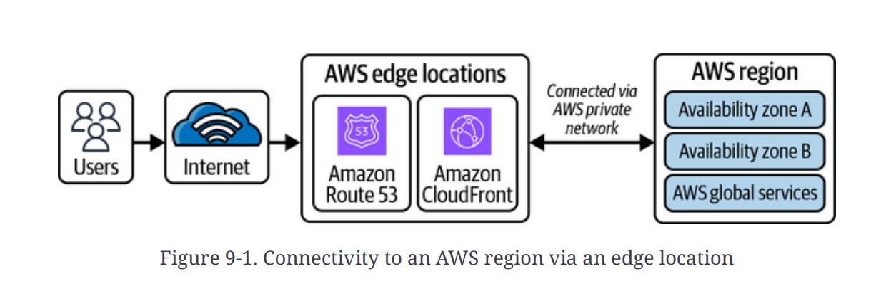

---

## Amazon Virtual Private Cloud (VPC)

The **Amazon VPC** service provides a virtual network that acts as a logically isolated private data center within the AWS cloud. It allows customers to securely launch resources (like Amazon EC2 instances or ELBs) and retain granular control over the network environment, including **IP address ranges, subnets, route tables, and gateways**.

### IP Addressing and Subnetting Concepts

Effective VPC design requires an understanding of the fundamental concepts used to define the address space:

- **IP Addresses:** Unique identifiers for every device on the internet, typically either **IPv4** or **IPv6**.

  - **IPv4:** A 32-bit address (four decimal numbers separated by dots). IP addresses are segmented into a **network ID** and a **host ID**, with the allocation defined by **IP classes** (A, B, C, D, E),.

    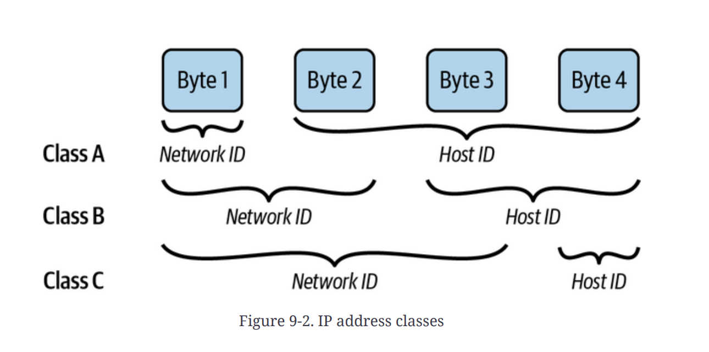

    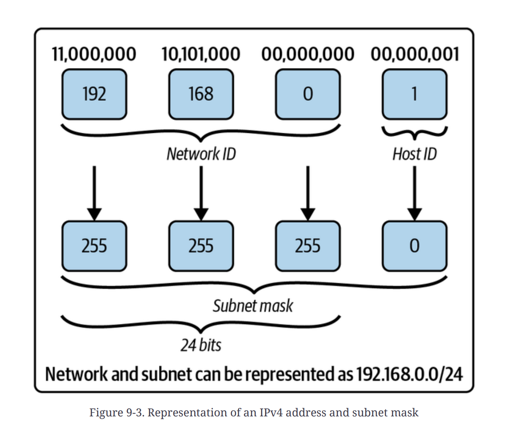

  - **CIDR (Classless Inter-Domain Routing):** A method of representing an IP address and its subnet mask using a suffix (e.g., `/16`), allowing for variable subnet mask lengths to optimize IP address space usage and slow the exhaustion of IPv4 addresses,.

    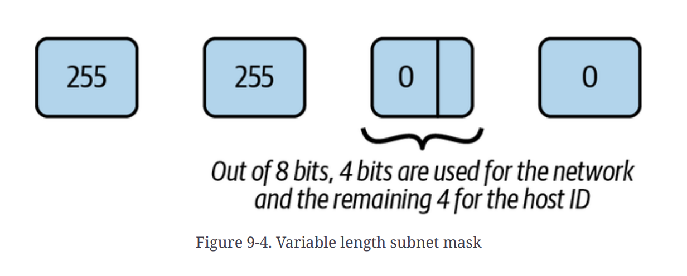

  - **IPv6:** A 128-bit address space, much larger than IPv4, represented by eight groups of hexadecimal digits separated by colons,.

    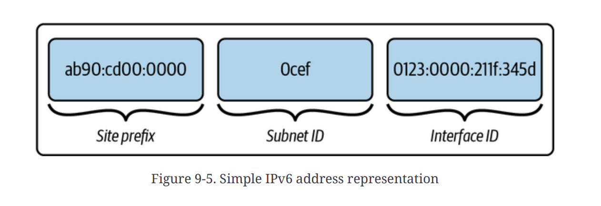

- **Public and Private IPs:** **Private IP addresses** are used for communication within a closed network and fall within reserved ranges (e.g., `10.0.0.0/8`). **Public IP addresses** (assigned by an ISP) are used for external communication over the internet.

  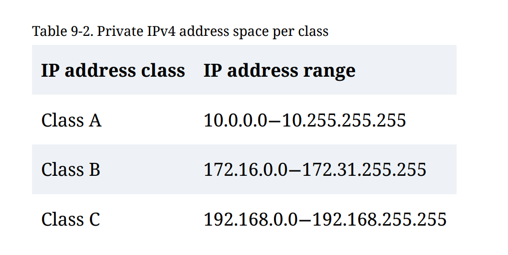

- **Elastic IP (EIP):** A **static, public IPv4 address** associated with an AWS account that can be assigned to an Amazon EC2 instance. It is used when a resource requires a consistent IP address, even if the underlying instance is replaced.

### VPC and Subnet Configuration

When creating a VPC, customers specify an initial **IPv4 CIDR block** (required input, usually private IP range, between `/16` and `/28`) and select the **tenancy** (shared or dedicated hardware),. The size of the CIDR block must be carefully planned as it cannot be changed later, and it must not overlap with other VPC CIDR blocks.

**Subnets** are logical subdivisions of the VPC's IP address space. Each subnet is associated with a single AZ, allowing resources to be physically distributed for fault tolerance.

- **Public Subnets:** Subnets configured with a route that directs traffic destined for the internet (`0.0.0.0/0`) to an **Internet Gateway (IGW)**.
- **Private Subnets:** Subnets that **do not have a direct route to an IGW**, limiting external access,. Sensitive resources should be placed here.

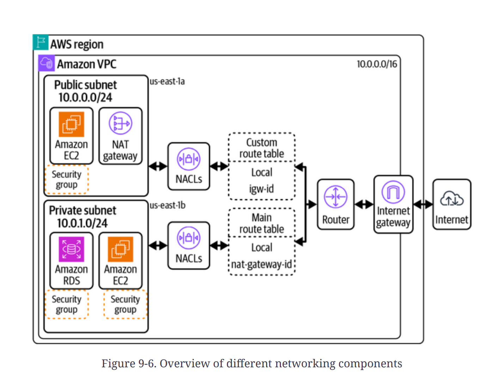

---

## Internet Connectivity and Network Security

### Routing Traffic

**Route Tables** are collections of rules that determine where network traffic from a subnet is directed.

- **Main Route Table:** Created implicitly with the VPC, containing the default local route, which facilitates communication between subnets.
- **Custom Route Tables:** Created explicitly to define specific routing rules. Routes consist of a **Destination** (the CIDR block for traffic) and a **Target** (the component, like an IGW, that routes the traffic),.

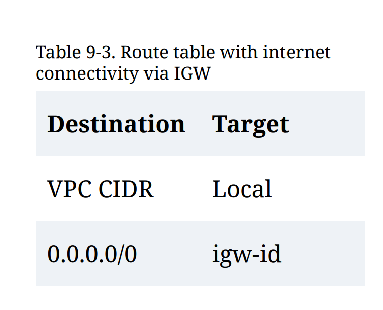

### Internet Access Components

1.  **Internet Gateway (IGW):** An AWS-managed, highly available, and scalable component that connects the VPC to the internet. It enables **bidirectional** traffic (inbound and outbound) for resources in **public subnets** and provides Network Address Translation (NAT) support for public IPs.
2.  **NAT Gateway:** A managed network device that allows resources in **private subnets** to initiate **outbound** internet connections (e.g., for downloading updates). Crucially, it prevents direct inbound access from the internet. It requires an EIP and should be deployed per AZ for high availability,.

### Security Mechanisms

AWS provides multiple software firewalls to control traffic flow:

- **Security Groups (SGs):** **Stateful** firewalls operating at the **instance level**,. They explicitly define **allow** rules for inbound and outbound traffic; any traffic not explicitly allowed is implicitly denied. Because they are stateful, a rule allowed in one direction (e.g., inbound) is automatically allowed in the opposite direction (outbound).

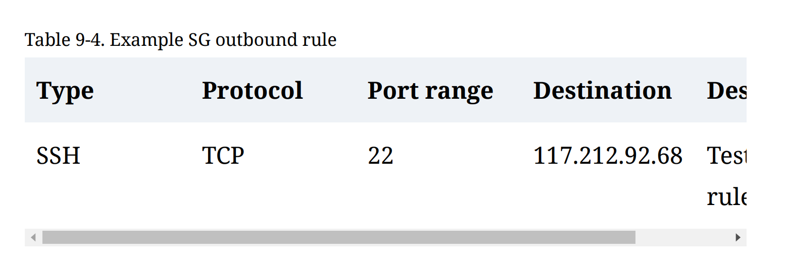

- **Network Access Control Lists (NACLs):** **Stateless** packet filters attached at the **subnet level**. NACLs provide the ability to define **explicit allow or deny** rules,. Rules are evaluated sequentially by number, with the first matching rule applied and subsequent rules skipped.

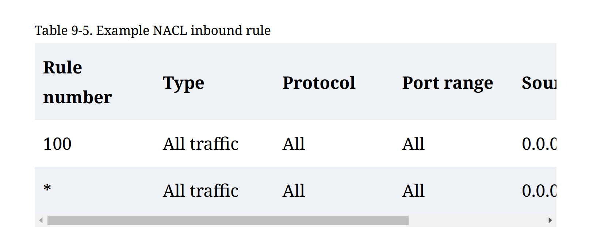

---

## Connectivity Options

### VPC-to-VPC Connectivity

When resources in different VPCs need to communicate privately, several AWS solutions are available:

- **VPC Peering:** Establishes a direct, **bidirectional** private network connection between two VPCs, making them act as if they were one network. It does not support transitive dependency and becomes complex to manage past a small scale.

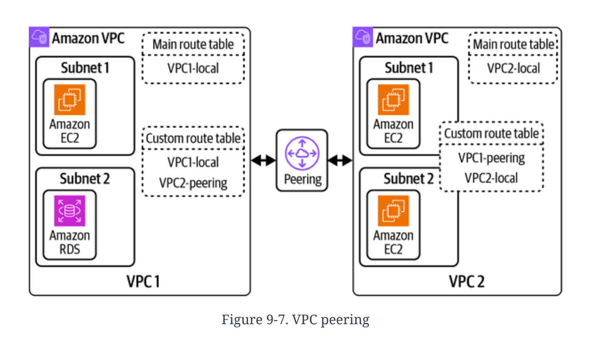

- **AWS Transit Gateway (TGW):** A scalable, regional **hub-and-spoke** solution that acts as a central router, connecting thousands of VPCs, on-premises networks, and other AWS services,. TGW is preferred over VPC peering for large scale and centralized network routing control.

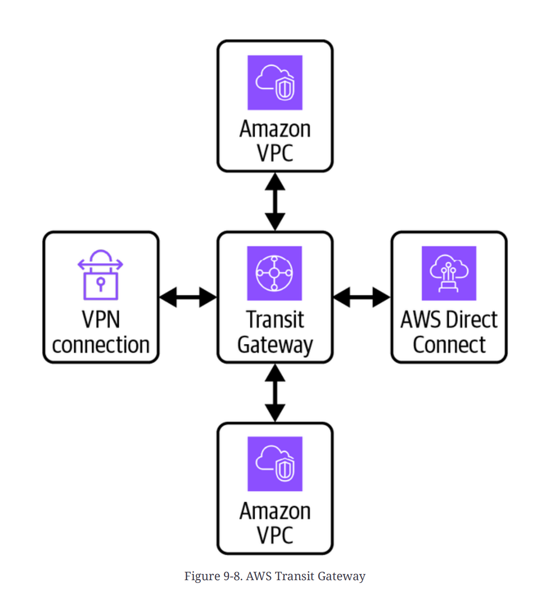

- **AWS PrivateLink:** Provides secure, **unidirectional** connectivity, exposing an application as a **Service Provider** to **Consumers** in another VPC using private IP addresses over the AWS backbone network,. This ensures traffic does not traverse the public internet.

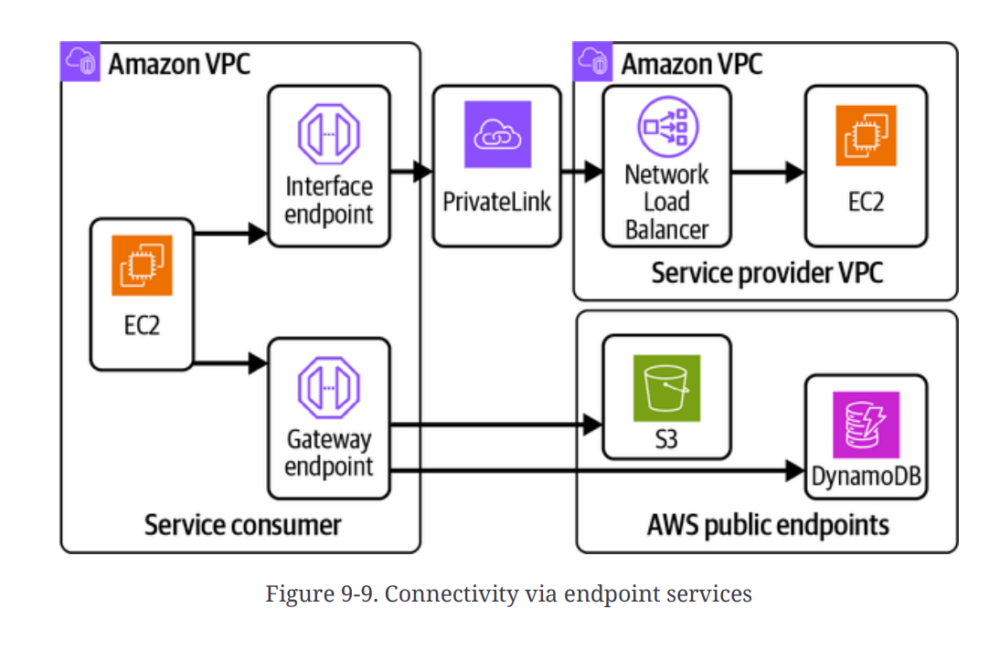

### Hybrid Connectivity (On-Premises to AWS)

To connect a customer's on-premises data center to the AWS cloud:

- **AWS VPN (Virtual Private Network):** Sets up a secure, encrypted connection channel over the internet between the customer's **Customer Gateway** and the AWS **VPN Gateway**,.

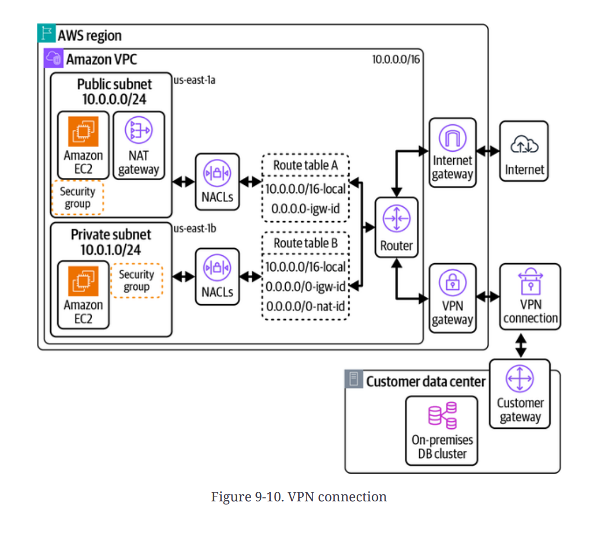

- **AWS Direct Connect:** Provides a dedicated, high-bandwidth network connection (fiber-optic cable) from the data center to an AWS Direct Connect location, bypassing the public internet entirely. Connections are established using a **Virtual Interface (VIF)**, which can be configured as public, private, or transit.

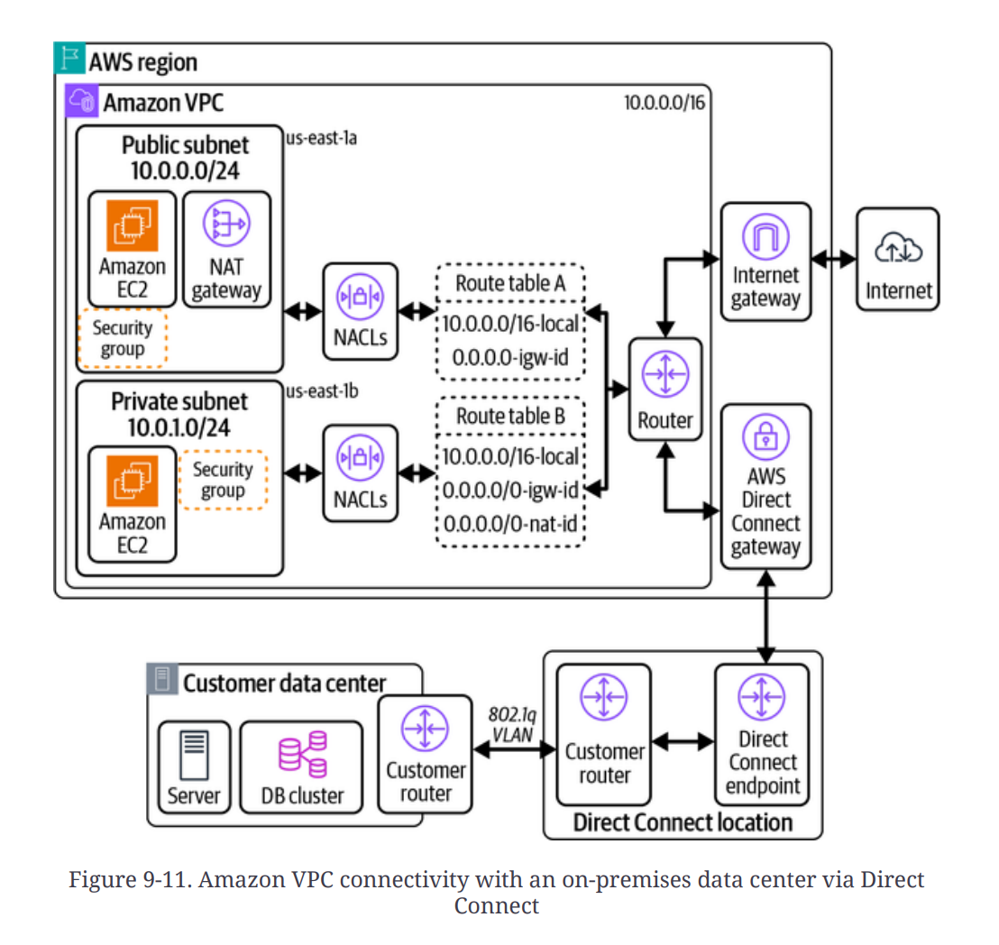

---

## Application Entry Points and Delivery

### Amazon Route 53

Route 53 is a highly available and scalable **Domain Name System (DNS)** service used for domain registration, DNS routing, and health checking. It facilitates the conversion of human-readable domain names (e.g., `www.google.com`) into network-required IP addresses,.

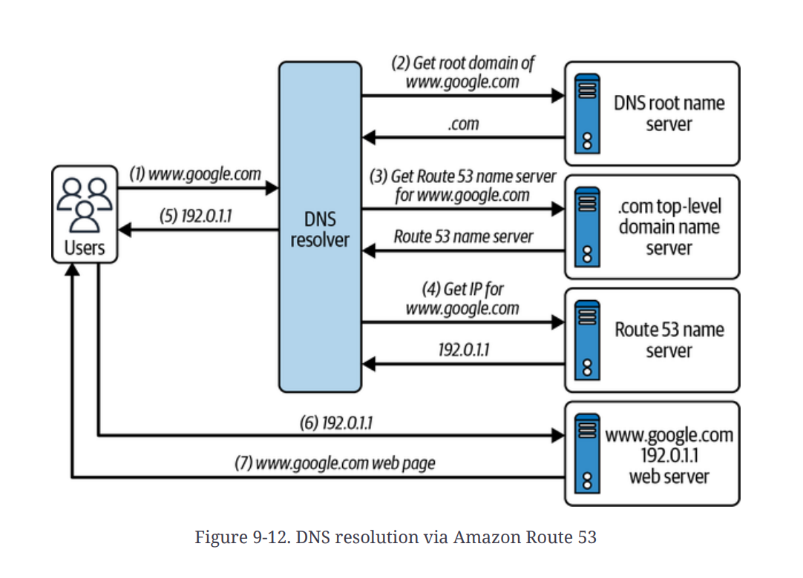

- **Alias Records:** A Route 53-specific feature that allows routing traffic directly to AWS resources (like ELBs or CloudFront distributions) at no additional cost for the DNS query.
- **Anycast:** Route 53 utilizes Anycast technology, routing requests to the nearest edge location globally to reduce latency and increase availability.

### AWS Elastic Load Balancer (ELB)

ELB is a managed service that automatically distributes incoming traffic across healthy targets (like EC2 instances or containers), ensuring high availability and scalability.

- **ELB Types:**

  - **Application Load Balancer (ALB):** Operates at **Layer 7** (Application Layer), making sophisticated routing decisions based on application parameters like HTTP headers, path, or cookies,. ALBs terminate connections (e.g., for SSL/TLS offloading),.
  - **Network Load Balancer (NLB):** Operates at **Layer 4** (Transport Layer) and makes fast routing decisions based purely on network variables like IP address and port,. NLBs are optimized for high performance, sudden spiky traffic, and long-lived TCP connections.
  - **Classic load balancer (CLB):** Legacy version of an LB that supports both L4 and L7 traffic
  - **Gateway load balancer (GWLB):** Used as an L3 gateway and L4 LB for the IP protocol

- **Functionality:** The client connects to the **Load Balancer**; **Listeners** check protocols/ports and forward traffic based on rules to **Target Groups** which direct traffic to the actual backend targets,.

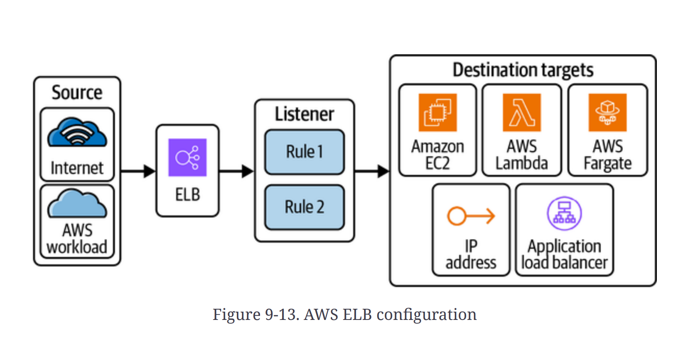

### Amazon API Gateway

API Gateway is a fully managed service for creating, publishing, and securing REST, HTTP, and WebSocket APIs. It acts as a **centralized facade** or gateway, abstracting backend complexities and integrating directly with various AWS services (like Lambda or DynamoDB) to serve client requests,.

- **API Types:** Supports **stateless** APIs (REST and HTTP) and **stateful** APIs (WebSocket).
- **Features:** Provides advanced features such as rate limiting, authentication (IAM, Cognito), integration with AWS WAF, and caching of endpoint responses,.

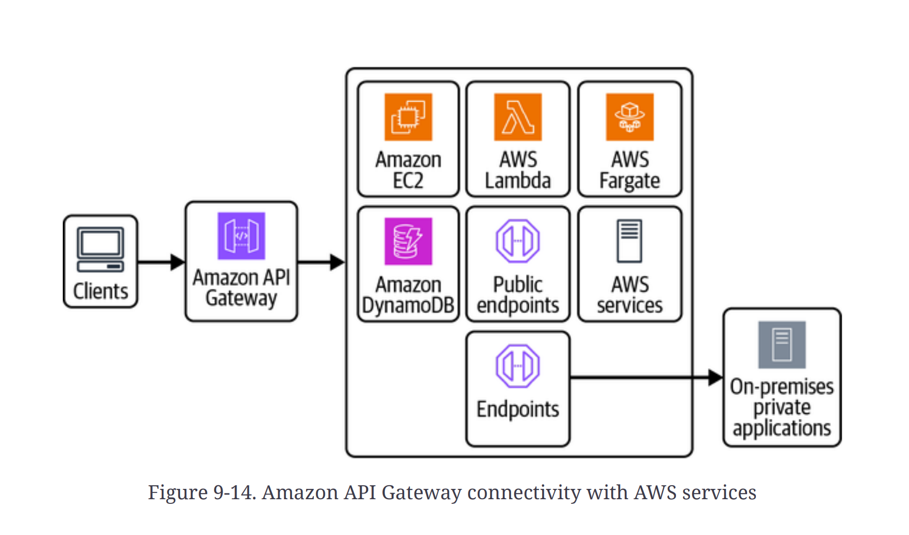

### Amazon CloudFront (CDN)

CloudFront is the AWS **Content Delivery Network (CDN)**, leveraging a global network of **edge locations** to cache content near end users. This strategy drastically reduces latency for serving both static content (e.g., images from S3) and dynamic content from web services,. CloudFront provides security features through integration with AWS Shield and WAF and ensures data protection via encryption.

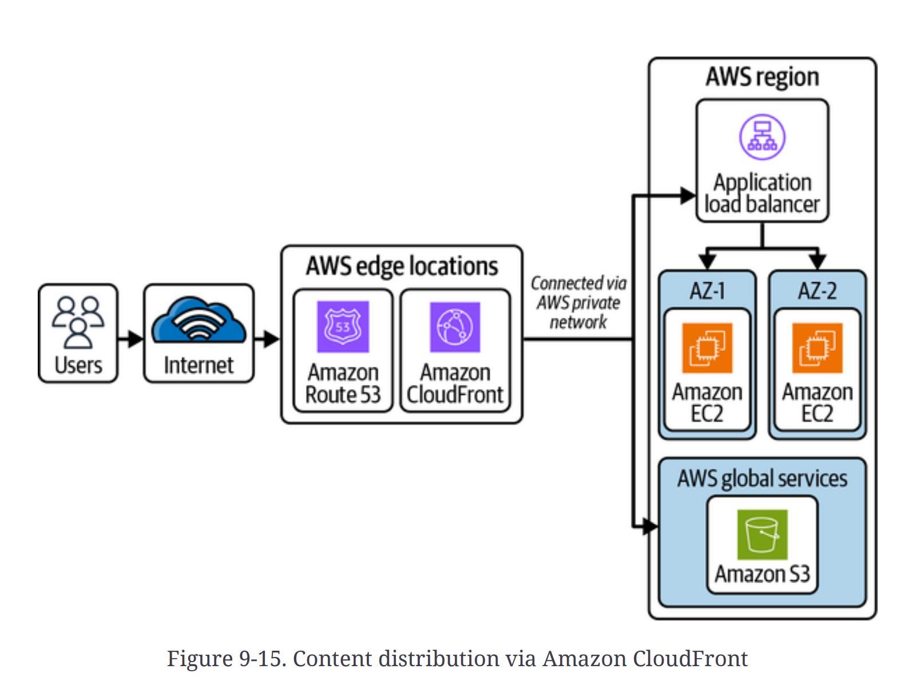
