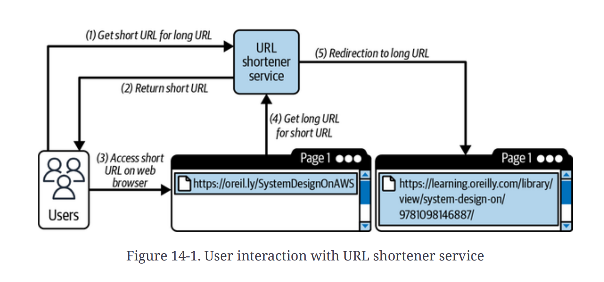
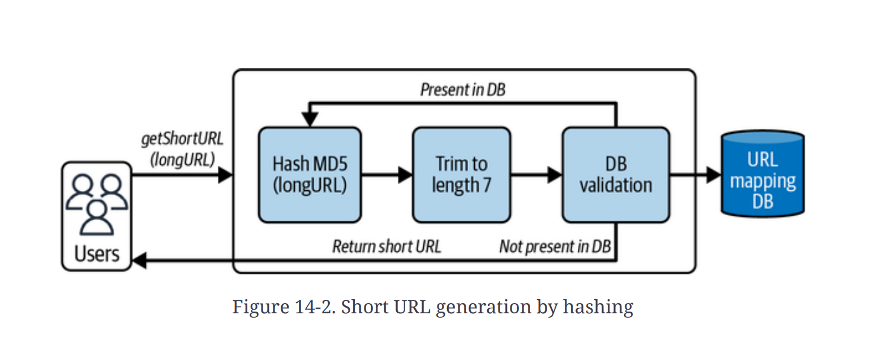
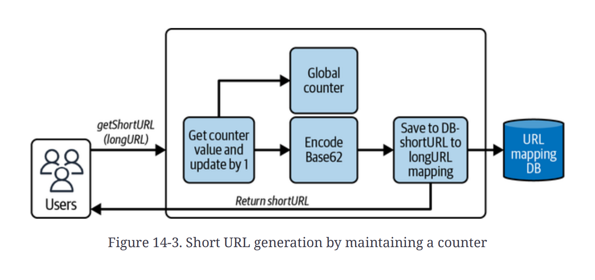
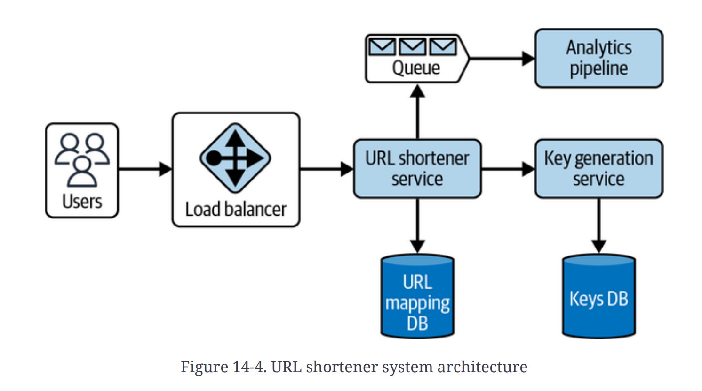
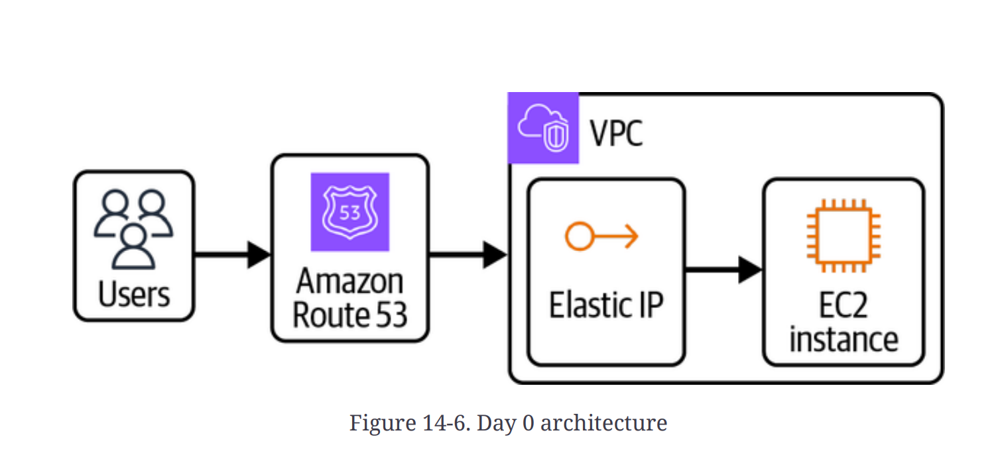
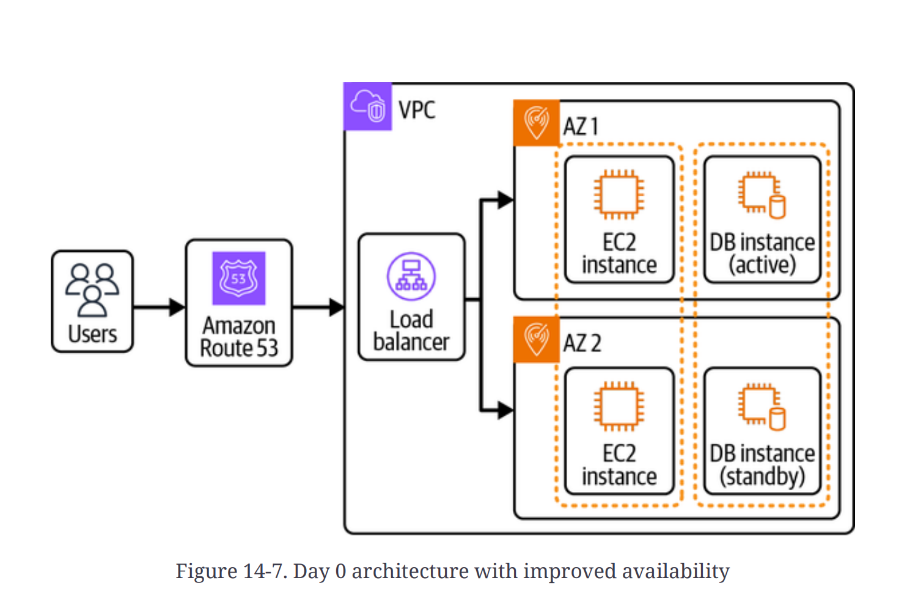
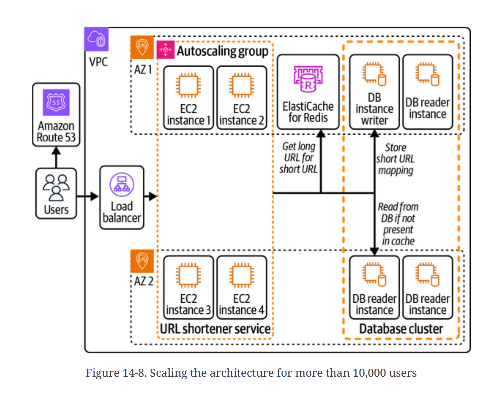
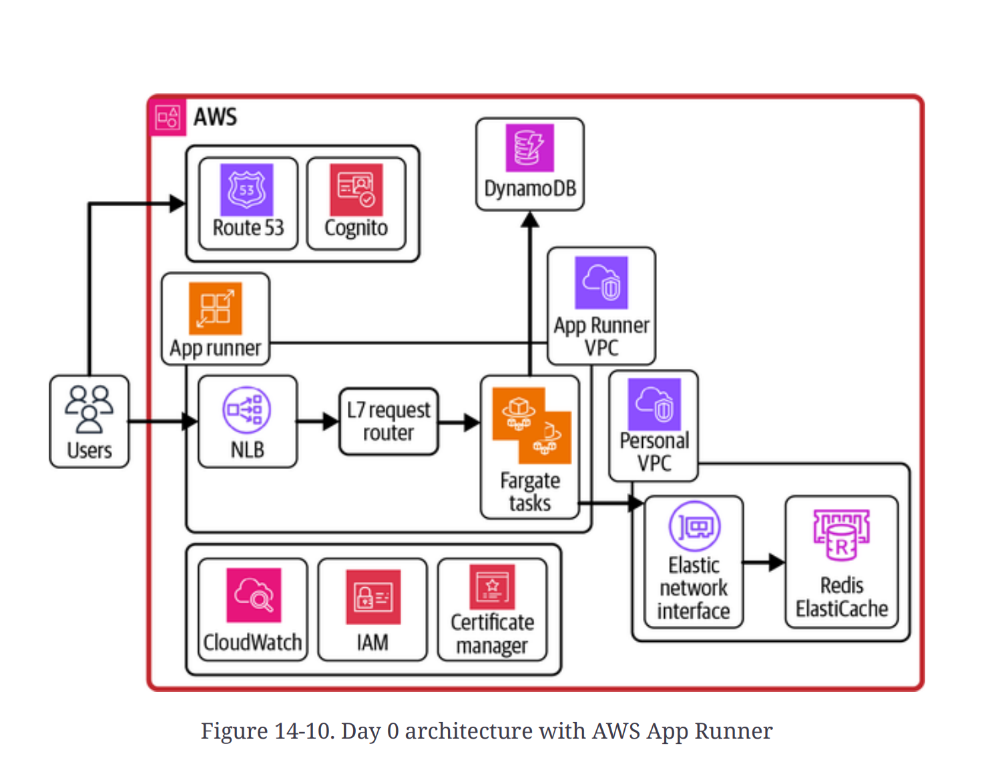
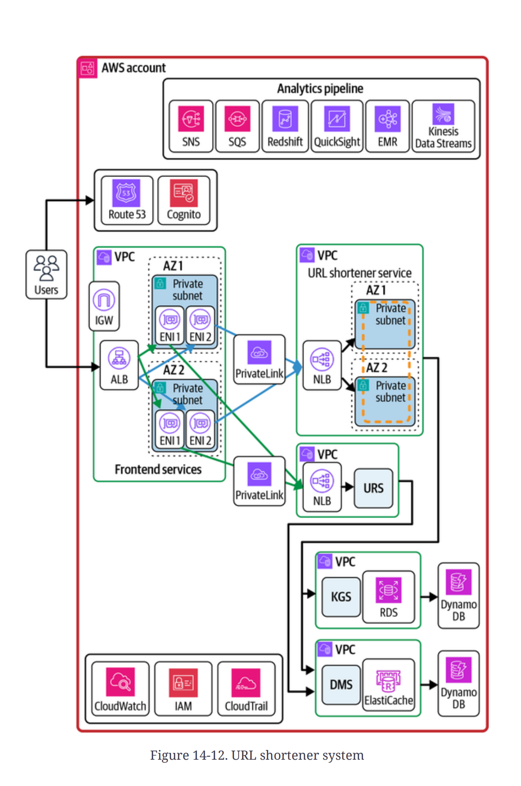

# Chapter 14. Designing a URL Shortener Service

This chapter explores the design and deployment of a URL shortener service on the AWS cloud,. URL shortener services take long web addresses and convert them into short, memorable ones, which helps increase readability and user interaction, especially in microblogging applications like Twitter (now X) where character limits apply.

## System Requirements

The design process begins with gathering functional requirements (what the system does) and nonfunctional requirements (NFRs, the constraints on how the system performs).

### Functional and Nonfunctional Requirements

The core expectations for a URL shortener service are that the system takes a long URL as input and returns a shortened URL. When the short URL is accessed by any user, it should redirect them to the corresponding long URL.

Value-add functional requirements include:

- **Custom URL creation:** Supporting user-defined shortened URLs.
- **Analytics:** Providing insights into URL access patterns, such as identifying the most popular URLs.
- **Expiration:** Allowing URLs to automatically expire and become inaccessible after a set period.
- **Extensibility:** Designing a plug-in-based architecture.
- **APIs:** Exposing APIs for integration with third-party clients.

Nonfunctional requirements (NFRs) ensure system quality and operational constraints:

- **Low Latency:** Crucial for both short URL creation and redirection processes.
- **High Availability and Fault Tolerance:** Ensuring high uptime and resilient operations, including mechanisms like retry handling,.
- **Observability:** Maintaining appropriate metrics and alerts for continuous monitoring of system health.
- **Security:** Protecting the system from exploitation by malicious actors.
- **Data Durability and Correctness:** Ensuring data persists until the configured expiration time or explicit removal.
- **Interoperability:** Designing the system to support interactions between multiple subsystems at high scale.

### System Scale and Storage Needs

The scale requirements are based on the expected user traffic, including the average and peak load for URL generation and redirection, and the resulting storage demands.

| Operation                                | Assumed Scale (RPS/QPS) |
| :--------------------------------------- | :---------------------- |
| Generate short URL from long URL (Write) | 1,000 RPS               |
| Short URL to long URL redirection (Read) | 20,000 RPS              |
| Average URL persistence duration         | One year                |

To avoid running out of unique short URLs, the URL length must be calculated based on the required scale. Using alphanumeric characters (0–9, a–z, A–Z), which totals 62 unique characters (base62 encoding), a length of **6 characters** yields $62^6 \approx 56.8$ billion unique URLs, which is sufficient for the estimated 31.53 billion URLs generated per year,. Considering future scale, a URL length of **7 characters** ($62^7 \approx 3.5$ trillion) is a strong choice.

The estimated storage requirement for one year, assuming 1 KB per URL (including the long URL, short URL, expiration date, and metadata), is approximately **29.37 TB**,.

## Starting with the Design

The most basic architecture involves users creating a short URL via the service, and subsequent users accessing the short URL are redirected by the service to the original long URL.

### URL Shortening Algorithm

1.  **Hashing:** Using a hash function (like MD5) on the long URL and truncating the output to a short length is easy to implement but suffers from **hash collisions**. At scale, collisions would require time-consuming database lookups to resolve, making the operation a bottleneck.

2.  **Unique ID Generation (KGS):** A better approach is to treat the process as generating a unique ID that is independent of the long URL.
    - Maintaining a global counter variable in a single application instance risks data loss if the server fails or race conditions if multiple threads access it concurrently,.
    - Maintaining the counter in a database adds reliability but requires implementing locks to prevent concurrent access, which increases latency.
    - **Decoupled Key Generation Service (KGS):** The optimal solution is pregenerating short URLs (unique IDs) since they are not dependent on the long URL. A dedicated KGS can generate a batch of unique IDs (e.g., 1,000 at a time) and store them in memory or a cache for the URL shortener service to consume rapidly upon request,. This approach solves both collision issues and avoids database lookups during the request path,.

#### KGS Implementation Details

The KGS's core challenge is generating globally unique IDs reliably.

- **Ticket Servers:** We can take inspiration from Flickr's architecture, which uses MySQL's `AUTO_INCREMENT` feature with `REPLACE INTO` queries to generate globally unique IDs. To enhance availability and avoid a single point of failure, **two ticket servers** can be used, configured to generate alternating even and odd IDs (e.g., `auto-increment-offset = 1` and `2`, respectively, with `auto-increment-increment = 2`).
- **Cross-Region Uniqueness:** For multi-region deployment, uniqueness can be maintained by adding a data center prefix to the short URL.
- **Base62 Encoding:** The unique numeric ID generated by the ticket servers is then converted into a short, alphanumeric string using Base62 encoding.

### System APIs

The URL shortener service requires two main APIs: one for creating a short URL and one for retrieval/redirection.

| API                  | Method | Parameters                                                   | Use                                                                                                                          |
| :------------------- | :----- | :----------------------------------------------------------- | :--------------------------------------------------------------------------------------------------------------------------- |
| `/v1/createShortUrl` | `POST` | `longUrl` (mandatory), `customUrl`, `expiry`, `userMetadata` | Generates a short URL. If `customUrl` is provided, the service checks the database for existing matches and fails if found,. |
| `/v1/getLongUrl`     | `GET`  | `shortUrl`, `userMetadata`                                   | Redirects the user. Returns a successful `HTTP/1.1 302 Found` response with the long URL in the `Location` header.           |

### System Considerations

The architecture is split into two systems: the URL shortener (write/creation) and the URL redirect (read/redirection). The traffic patterns are highly skewed, with redirection traffic significantly higher than generation traffic.

- **Database Access Layer:** Since both services access the same database (DynamoDB for URL mappings and KGS ticket servers), using a separate **Data Management Service** (a thin layer of CRUD APIs) is recommended to manage all database operations and cache maintenance. This ensures that multiple services do not directly interact with a single database instance.

### Database Selection

1.  **URL Shortener Service Database:**

    - The service requires structured data storage and efficient lookups (long URL given short URL).
    - **Amazon DynamoDB** (key-value store) is suitable due to its horizontal scaling, infrastructure management, Time-to-Live (TTL) configuration, and eventual consistency support.
    - **DynamoDB Schema:** The primary key is the **Partition Key** (`{short URL}`) and a constant **Sort Key** (`SU`). To retrieve all URLs created by a specific user (a secondary query pattern), a **Global Secondary Index (GSI)** is needed, likely using the pattern: Partition Key = `{userId}`, Sort Key = `u#{timestamp}`.

2.  **KGS Cache/Storage:**
    - The KGS needs to buffer unique IDs in memory for fast access.
    - An in-memory data store like **Amazon ElastiCache** (using the Redis flavor with its List data structure) is appropriate for storing these pregenerated IDs.

### Custom Domain Support

Custom domain support allows third-party clients (tenants) to use their own short domain names (e.g., `google.ly/xyz`) while leveraging the underlying shortener service. This requires designing the system as a **multitenant system**.

- **Partitioning by Tenant ID:** To support multiple tenants using a single DynamoDB table, the schema must include the tenant identifier.
  - The primary key structure can be redefined as: Partition Key = `{short URL}`, Sort Key = `{tenant ID}`.
  - The short URL and tenant ID combination ensures unique storage, and the tenant ID is derived from the credentials or the domain accessed.
- **Cell-Based Architecture:** For extreme scalability and resource isolation, a **cell-based architecture** is preferred. Each cell independently serves a set of onboarded tenants, reducing the blast radius and ensuring that data is not shared between them.

## Launching the System on AWS

The deployment strategy follows the **Make It Work, Make It Right, Make It Fast** principle, starting with a Minimum Viable Product (MVP) known as Day 0 architecture.

### Day Zero Architecture

The initial architecture for a limited user base (Day 0) should prioritize simplicity and use manageable AWS services.

1.  **Monolith Start (Evolution):** An initial monolithic application on a single EC2 instance is simple but poses a single point of failure. This is quickly improved by separating the database (with primary/standby instances) and deploying **multiple EC2 instances behind an Elastic Load Balancer (ELB)** across Availability Zones (AZs).

2.  **Scaling Read Traffic (10,000+ users):** As traffic increases, **database read replicas** are introduced to offload the primary write instance. A **caching layer** is placed in front of the read replicas (e.g., Redis) to serve frequently accessed short URLs, reducing database load and improving query performance. A **CDN (Amazon CloudFront)** should also be introduced to cache the content closer to the users.

3.  **Serverless Approach (Preferred Day 0):** To minimize operational overhead, the initial architecture should leverage serverless components.

    - **Compute:** Use **AWS Lambda functions** to host application logic (e.g., separate Lambdas for creation and redirection APIs).
    - **Alternative Compute:** **AWS App Runner** offers a fully managed service for deploying containerized web applications, abstracting components like ECS Fargate, autoscaling, and ELB,. App Runner is built on ECR images or GitHub source code.

    

    - **Deployment Flow (App Runner example):** User requests resolve via Route 53 to an NLB, which forwards traffic to an application Layer 7 (L7) request router, which then redirects to App Runner's ECS Fargate tasks.
    - **Storage and Cache:** **Amazon DynamoDB** serves as the persistent data store, backed by **Amazon ElastiCache** for high-speed caching.

## Scaling to Millions and Beyond

Scaling requires continuously reevaluating bottlenecks, especially related to latency, storage limits, and service quotas,.

### Observability

- **Monitoring:** Proper metrics, alerts, and alarms (via **Amazon CloudWatch** and **AWS X-Ray**) are critical for identifying performance bottlenecks, such as slow query latency or high failure rates.

### Storage Layer Scaling

- **DynamoDB Global Tables:** For multi-region deployments, DynamoDB Global Tables ensure data replication across regions, though potential replication lag must be acknowledged.
- **Cache Selection:** Using a caching layer (**Amazon DAX** or **Amazon ElastiCache**) is crucial to reduce latency from single-digit milliseconds to microseconds,. DAX is purpose-built for DynamoDB, but ElastiCache (Redis in cluster mode) might be preferred if the team has existing expertise or if it is already used for other services,.
- **Handling Hot Partitions:** High traffic on a single partition key (`{short URL}`) can lead to requests throttling if the limits (3,000 RCUs/1,000 WCUs) are breached,,. While throttling recovers automatically in on-demand mode, switching to provisioned mode with prescaled capacity can mitigate throttling for predictable traffic.

### Compute Layer Scaling

- **Serverless Quotas:** While AWS Lambda scales automatically, the latency spike from cold-start issues might require mitigating strategies like **provisioned concurrency**. AWS App Runner has quotas on instances and concurrent requests (e.g., 25 instances, 5,000 concurrent requests per service), which may require migration to a custom **Amazon ECS/EKS** cluster if the required scale exceeds these soft limits,.
- **Deployment Evolution:** Moving from fully managed services (Lambda/Fargate) to **Amazon ECS with EC2** offers fine-grained control over hardware configurations and potentially lower costs at massive scale, although it increases operational overhead.

### Multimicroservice Architecture and Isolation

For Day N architecture, the system is decomposed into specialized microservices to ensure isolation, flexibility, and independent scaling.

| Microservice                | Function                                        | Purpose                              |
| :-------------------------- | :---------------------------------------------- | :----------------------------------- |
| **Frontend Service**        | Handles customer traffic and redirects requests | Acts as a gateway/rate limiter.      |
| **URL Creator Service**     | Generates URLs and writes to the database       | Handles write traffic.               |
| **URL Reader Service**      | Redirects short URLs to long URLs               | Handles high-volume read traffic.    |
| **KGS**                     | Generates and manages unique keys               | Supports decoupled ID generation.    |
| **Data Management Service** | Provides a CRUD layer over the database/cache   | Manages centralized database access. |

To ensure robust isolation, microservices should be deployed in separate **Virtual Private Clouds (VPCs)**,. **AWS Transit Gateway** provides scalable bidirectional communication between these VPCs, while **AWS PrivateLink** is used for secure, unidirectional, private connectivity when services communicate within the AWS backbone (avoiding NAT gateways unless explicit internet access is required).

## Day N Architecture (Final AWS Deployment)

The final scalable architecture deploys services across multiple VPCs using containerization (e.g., separate EKS clusters per service for resource isolation).

Key components and considerations in the Day N architecture:

- **Containerization:** Using **Amazon EKS** (or ECS) provides isolation and management for high-scale compute.
- **Networking:** VPCs are connected using **AWS Transit Gateway** or **PrivateLink**.
- **Databases:** **DynamoDB** (persistent store) is paired with a highly available, sharded **Amazon ElastiCache cluster (Redis)** for low-latency reads.
- **Redundancy and Consistency:** Resources are deployed in **multiple AZs** for resiliency. An AWS Lambda function can be triggered by DynamoDB data deletion events (TTL expiration) to ensure corresponding data is immediately removed from the cache layer.
- **Security:** **API Gateway** acts as the ingress point, applying throttling and integrating with AWS WAF/Shield to block unwanted traffic.

| Scaling Component | Strategy                                                                                             | Benefit                                                                                   |
| :---------------- | :--------------------------------------------------------------------------------------------------- | :---------------------------------------------------------------------------------------- |
| **Database**      | DynamoDB Global Tables, careful schema design (Partition Key, GSI), ElastiCache/DAX implementation,. | Handles petabytes of data, low-latency lookups, and resilience against regional failure,. |
| **Read Path**     | Separate URL Reader Service, caching layers (CloudFront, ElastiCache),.                              | Optimizes for the high volume of redirection traffic.                                     |
| **Isolation**     | Separate VPCs and EKS clusters for core microservices,.                                              | Ensures clear separation of concerns, independent scaling, and reduced blast radius.      |

The ultimate guideline for system design is that it is an **iterative process**; the architecture should always be flexible enough to be modified or replaced if bottlenecks arise or requirements change,.
