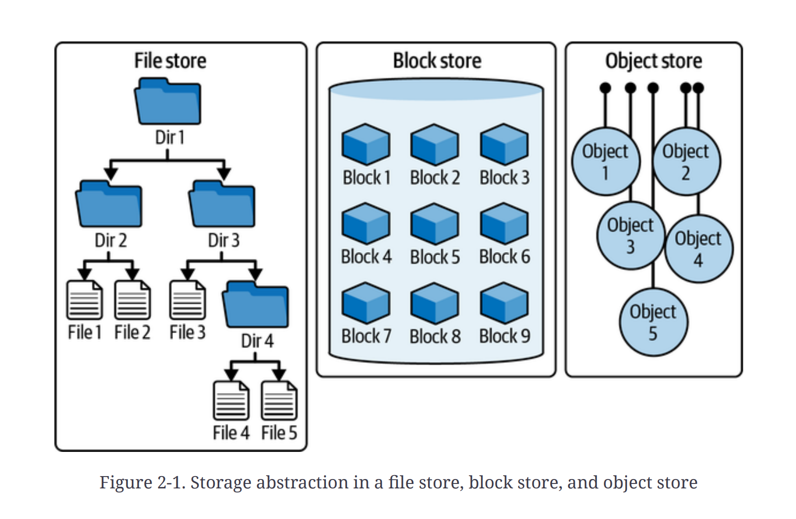
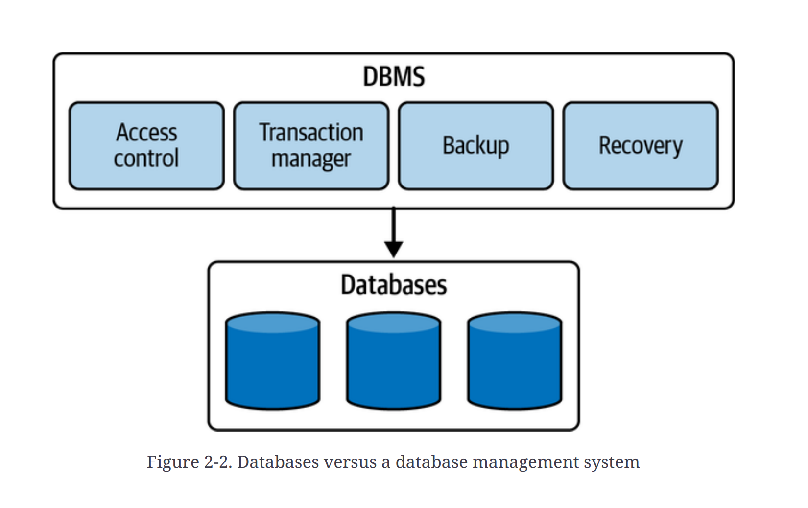

## Types of Storage

1. **Block Storage**: (for unstructured data and high-performance applications and databases)

    - **Description**: Data is stored in fixed-size blocks. Each block can be accessed and managed independently.
    - **Use Cases**: Databases, virtual machines, container volumes, and applications requiring low latency and high IOPS.
    - **Examples**: Amazon EBS, Google Persistent Disk, Azure Managed Disks.
    - **Notes**: Typically exposed via iSCSI or similar block protocols; supports snapshots and fine-grained backup.

2. **Object Storage**: (for unstructured data and large-scale applications)

    - **Description**: Data is stored as objects (data + metadata + unique ID) accessible via an HTTP-based API. Designed for massive scale and durability.
    - **Use Cases**: Storing images, videos, logs, backups, and static website assets.
    - **Examples**: Amazon S3, Google Cloud Storage, Azure Blob Storage.
    - **To Remember**: Not optimal for low-latency, high-IOPS workloads or POSIX filesystem semantics; excellent for cost-effective, highly durable storage and lifecycle policies.

3. **File Storage**: (for structured data and file sharing)

    - **Description**: Data is stored as files in a hierarchical namespace and accessed via network file protocols (NFS, SMB). Provides POSIX semantics where required.
    - **Use Cases**: Content management systems, home directories, shared media repositories, Lift-and-shift applications requiring file shares.
    - **Examples**: Amazon EFS, Google Filestore, Azure Files.
    - **Notes**: Good for collaborative workloads and apps that require file locking and directory structures.

## How to Choose the Right Storage Type

- **Performance requirements**: Use block storage for high IOPS and low latency. File storage can meet moderate latency needs for shared access. Object storage is optimized for throughput and large sequential reads/writes rather than low-latency random I/O.
- **Access patterns**: Random, small I/O (databases) → block. Many large sequential reads/writes (media streaming, backups) → object. Multiple clients sharing files → file storage.
- **Scalability and capacity**: Object storage scales virtually infinitely and is best for very large datasets. Block and file systems have practical performance and capacity limits dependent on the provider.
- **Consistency and semantics**: Need POSIX semantics (rename, locking, permissions) → file. Strong block-level semantics for filesystem on top of volumes → block. Object APIs provide eventual or read-after-write semantics depending on provider.
- **Durability and redundancy**: Object storage typically offers the highest built-in durability and geo-replication options. Block/file durability depends on replication and backup strategies.
- **Cost model**: Object: low per-GB cost, may charge per request and egress. Block: charged per-provisioned capacity and IOPS in some providers. File: charged per GB and performance tier.
- **Data management features**: If you need metadata, lifecycle policies, versioning, or cheap archival transitions, object storage is ideal.
- **Protocol and compatibility**: Existing applications that expect NFS/SMB → file. Applications that can use S3 API → object. VMs/DBs expecting raw block devices → block.
- **Backup, snapshot, and recovery**: Block and many managed file systems support fast snapshots. Object storage often provides lifecycle and versioning for retention and recovery.
- **Security and compliance**: Evaluate encryption at rest/in transit, IAM, and audit features across options.
- **Hybrid / on‑premise needs**: Consider managed file services or gateway products if you need local protocol compatibility with cloud-backed object storage.

Quick decision guide:
- Database, VM boot/data disk, high-IOPS app → Block storage.
- Large-scale unstructured data, backups, static assets → Object storage.
- Shared files, legacy apps requiring POSIX/NFS/SMB → File storage.
- Combine storage types when needed: e.g., object for archival, block for DB, file for shared workloads.

## Databases

1. **Relational Databases (RDBMS)**: (for structured data with complex relationships)

    - **Description**: Use structured query language (SQL) to define and manipulate data. Data is organized into tables with predefined schemas.
    - **Use Cases**: Financial systems, customer relationship management (CRM), enterprise resource planning (ERP).
    - **Examples**: MySQL, PostgreSQL, Oracle Database, Microsoft SQL Server.
    - **Notes**: Strong ACID compliance; suitable for complex queries and transactions.

2. **NoSQL Databases**: (for unstructured or semi-structured data and scalability)
    - **Description**: Designed for distributed data stores with flexible schemas. Includes various types such as document, key-value, column-family, and graph databases.
    - **Use Cases**: Real-time web applications, big data analytics, content management systems.
    - **Examples**: MongoDB (document), Cassandra (column-family), Redis (key-value), Neo4j (graph).
    - **Notes**: Often prioritize scalability and performance over strict ACID compliance; suitable for large-scale, distributed applications.